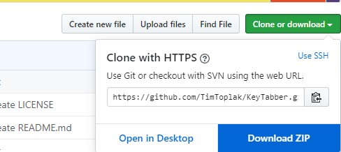
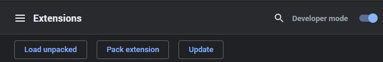
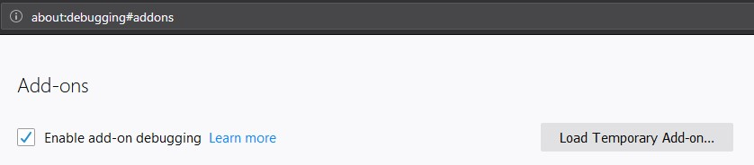

# KeyTabber

Pressing Tab key only switch between most used links

## Installation

Extension is not yet publishet to Google extension store or Firefox one. Only way to install it is through source code.

1.  Download source code as ZIP and extract it

#### Google chrome

2.  copy: **chrome://extensions/** and paste it in search bar
3.  enable developer mode

4.  click button **Load unpacked** and select folder containing source code
    

#### Firefox

2.  copy: **about:debugging#addons** and paste it in search bar
3.  click button **Load Temporary Add-on...** and go to folder containing source code
    
4.  select **manifest.json** file

## Demo

Move to next link: <kbd>Tab</kbd>

Move to previous link: <kbd>Shift</kbd>+<kbd>Tab</kbd>

#### Google

Before enabling extension:

After enabling extension:

#### YouTube

Automatically expand more recommended videos.

Before enabling extension:

After enabling extension:

#### Reddit

Before enabling extension:

After enabling extension:

### License

MIT
